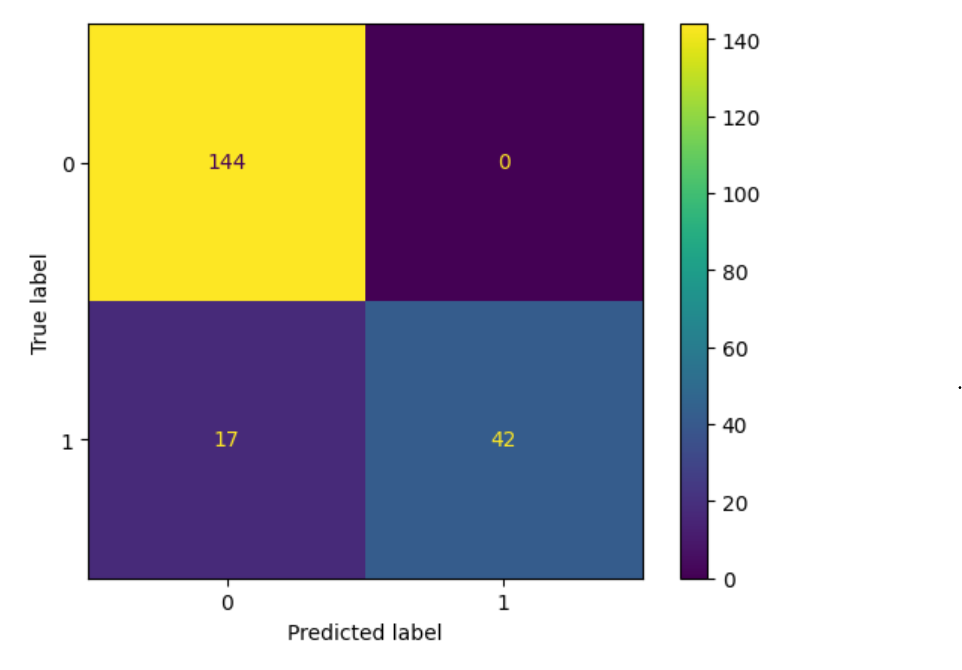
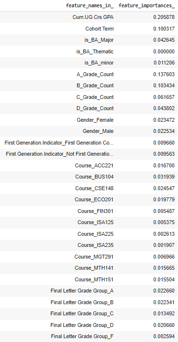

## Session Information

For the purpose of data reproducibility, we included the session info and loaded all required packages in this one location.

```{r setup, include=FALSE}
knitr::opts_chunk$set(echo = TRUE)

if(require(pacman)==FALSE) install.packages("pacman")
pacman::p_load(#DataExplorer, # For explorer and cleaning data by visualizing missing values.
               gptstudio,#For coding assistance
               httr, # For downloading the data from the UCI
               tidyverse, # For data manipulation
               sjPlot, 
               corrplot, # for heatmaps
               DataExplorer, #for exploring data
               skimr, # for nice summary of data
               readxl,
               dplyr
               ) # For creating dummy variables of categorical variables automatically.)
```

```{r}
sessionInfo()
```

## Time Series Analysis

The following charts are the distinct counts of students enrolled in each business analytics programs. Programs include the Business Analytics Major, Minor, and thematic sequenced (named Applied Business Statistics). Each program is plotted individually over term from fall 2018 to fall 2024. We intend on adding to each bar chart the % growth each semester and a line of best fit. Plotting the line of best fit will return a prediction for a future semester.We also intend on continuing to improve the aesthetics and understandably of each graph with better labeling and spacing. 

### ISA2 Applied Business Statistics Thematic Sequence over Terms

```{r}
data = read_excel("Thematic Sequence.xlsx")

colnames(data) <- c("Term.Code", "Enrolled.Student.Count")

new_data <- data.frame(
  Term.Code = c(202420, 202510),
  Enrolled.Student.Count = c(52, 42))

new <- rbind(data, new_data)
```

```{r}
p <- ggplot(new, aes(x = `Term.Code`, y = `Enrolled.Student.Count`, fill = factor(`Term.Code`))) +
  geom_bar(stat = "identity", color = "steelblue", width = 0.8) +
  xlab("Term.Code") +
  ylab("Enrolled.Student.Count") +
  ggtitle("ISA2 Thematic Sequence Enrollment over Terms") +
  theme_bw() +
  theme(axis.text.x = element_text(angle = 45, hjust = 1)) +
  geom_text(aes(label = `Enrolled.Student.Count`), vjust = -0.5, color = "black", size = 3) +
  coord_cartesian(ylim = c(0, 300)) +
  scale_fill_manual(values = c(rep("steelblue", nrow(new) - 2), "orange", "orange"))+
   guides(fill = FALSE)

p
```

Naive forecasting, last semester is the prediction for this semester.

```{r}
### Business Analytics Minor over Terms

data = read_excel("BA Minors.xlsx")

colnames(data) <- c("Term.Code", "Enrolled.Student.Count")

new_data <- data.frame(
  Term.Code = c(202420, 202510),
  Enrolled.Student.Count = c(185, 147))

new <- rbind(data, new_data)

p <- ggplot(new, aes(x = `Term.Code`, y = `Enrolled.Student.Count`, fill = factor(`Term.Code`))) +
  geom_bar(stat = "identity", color = "steelblue", width = 0.8) +
  xlab("Term Code") +
  ylab("Enrolled Student Count") +
  ggtitle("Business Analytics Minor Over Terms") +
  theme_bw() +
  theme(axis.text.x = element_text(angle = 45, hjust = 1)) +
  geom_text(aes(label = `Enrolled.Student.Count`), vjust = -0.5, color = "black", size = 3) +
  coord_cartesian(ylim = c(0, 300)) +
  scale_fill_manual(values = c(rep("steelblue", nrow(new) - 2), "orange", "orange"))+
   guides(fill = FALSE)

p
```

### Business Analytics Major over Term

```{r}
merged_data = read.csv('StudentData')

ba_major_counts_by_term <- aggregate(Major.1 ~ Term.Code, data = merged_data, function(x) sum(x == "BA Major"))

ba_major_counts_by_term2 <- aggregate(Major.2 ~ Term.Code, data = merged_data, function(x) sum(x == "BA Major"))

ba_major_counts_by_term3 <- aggregate(Major.3 ~ Term.Code, data = merged_data, function(x) sum(x == "BA Major"))

# Assuming ba_major_counts_by_term, ba_major_counts_by_term2, ba_major_counts_by_term3 are your data frames
merged_counts <- merge(ba_major_counts_by_term, ba_major_counts_by_term2, by = "Term.Code", all = TRUE)
merged_counts <- merge(merged_counts, ba_major_counts_by_term3, by = "Term.Code", all = TRUE)

# Replace missing values with zeros
merged_counts[is.na(merged_counts)] <- 0

# Set column names for clarity
names(merged_counts) <- c("Term.Code", "BA_Major_Count_1", "BA_Major_Count_2", "BA_Major_Count_3")

```
```{r}
merged_counts <- merged_counts %>%
  mutate(Sum_BA_Major_Count = BA_Major_Count_1 + BA_Major_Count_2 + BA_Major_Count_3)

merged_counts <- merged_counts %>%
  select(Term.Code, Sum_BA_Major_Count)
```

```{r}

#print(merged_counts)
merged_counts$Term.Code <- as.character(merged_counts$Term.Code)

```

```{r}
new_data <- data.frame(
  Term.Code = c(202420, 202510),
  Sum_BA_Major_Count = c(356, 430))

new <- rbind(merged_counts, new_data)

p <- ggplot(new, aes(x = `Term.Code`, y = `Sum_BA_Major_Count`, fill = factor(`Term.Code`))) +
  geom_bar(stat = "identity", color = "steelblue", width = 0.8) +
  xlab("Term Code") +
  ylab("Enrolled Student Count") +
  ggtitle("Business Analytics Major Over Terms") +
  theme_bw() +
  theme(axis.text.x = element_text(angle = 45, hjust = 1)) +
  geom_text(aes(label = `Sum_BA_Major_Count`), vjust = -0.5, color = "black", size = 3) +
  coord_cartesian(ylim = c(0, 500)) +
  scale_fill_manual(values = c(rep("steelblue", nrow(new) - 2), "orange", "orange"))+
   guides(fill = FALSE)

p
## 51.5 change between 2022 and 2023
## 21.5 change between 2023 and 2024
## = 36.5% average between those two
## or we could continue the trend of 21% growth 
```

## Random Forest Model

Our goal is to understand a business analytics student's progression through their program and therefore we added a flag (column with 1 or 0) to denote if they left their program or not (1= leave, 0 = stay) at anytime. With this information, we can track what students leave which we used in a predictive model as the target variable. 

We developed a Random Forest Regression model in Google Colab in Python (due to having more experience with statistical modeling in Python vs R) and are in the process of converting it into an R markdown file. This is the outcome of the model, of which we can improve with hyper parameters. The accuracy score is about 80% with an ROC curve estimate of 0.72. The ROC curve plots the True Positive Rate (TPC) against the False Positive Rate (FPR). These are shown in our Confusion Matrix. An ROC curve closer to 1 is interpreted as better performance and therefore our model of 0.72 indicates that it is acceptably accurate. The accuracy score indicates that our model can predict whether a student will drop their program or not with 80% accuracy. From this base model, we will continue to use certain parameters improve the model's accuracy. We will also provide a more thorough interpretation of the model and outcomes. 




