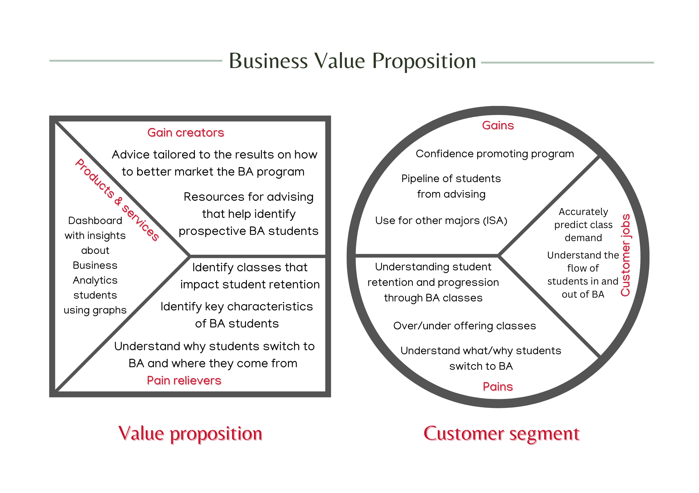
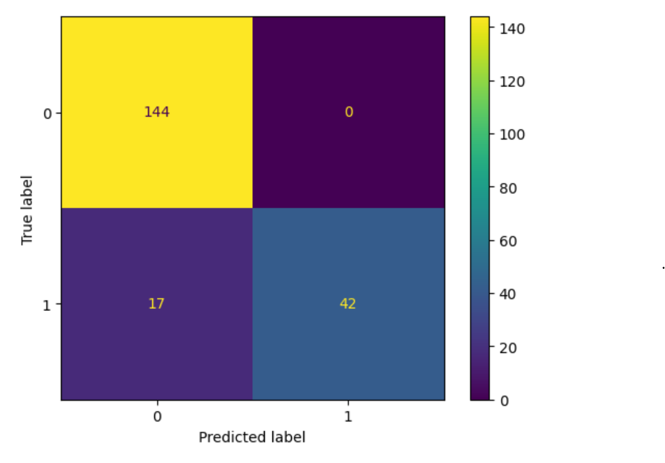

## Introduction

This document is meant to summarize where we currently are (group 8) in the beginning off our analysis project for ISA 616.

## Client

Skip Benamati, Alan Strautman, and the Business Analytics/ISA Dept.

## Problem Statement

It is challenging to predict demand for the program and course size for the Business Analytics program.
Skip and the BA department would like to know the forecasted number of students so that courses are not offered over abundantly or insufficiently.

## Timeline

-   Friday 11/3 - observe the data and define expectations for the group and project scope Assignees : ALL

-   Sunday 11/5 - have BVP submitted, Github setup (First checkpoint) BVP Assignees : Marti, Project Documentation Assignees: Alaina and Max, GitHub repo setup: Jenna

-   Thursday 11/9 - have data cleaned and merged, Rmarkdown file used that includes the documentation our work Data Cleaning : Jenna Data Merging: Marti Adding context and Relevant information to file : Max, Alaina

-   Saturday 11/18 - Marti and Jenna build predictive model and Max finish building time series charts

-   Sunday 11/19 - Team meets to finish and turn in Checkpoint 2

-   Tuesday 11/28 - Team meets to review feedback and build final deliverables, Assignees: All

-   12/1 - Final project deliverable due, Assignees: all 

-   12/5 - Group presentation, Assignees: all


## Business Value Propositions



Client:

-   Skip Benamati Professor and chair of the Information Systems &
    Analytics along with his staff including Alan Clift (Data and
    planning Analyst)

Jobs:

-   Accurately predict demand for classes

-   Understand the flow of students in and out of Business Analytics
    major

Pains:

-   Before:

    -   Abundance of BA majors who end up dropping

-   During:

    -   Student retention -- understanding characteristics of students
        who stay and do not stay with the BA major

    -   Understanding what students are switching to the BA major

    -   If BA courses have an impact on whether students stay in
        business analytics

-   After:

    -   Over offering classes (results in too many small sized classes)

Solution:

-   Dashboard with insights about Business Analytics students using
    graphs and other visuals

Pain Killers:

-   Identify key characteristics of students who leave the major

-   Identify classes that may need curriculum change in order to retain
    my students

-   Understand why students switch to the BA major and what majors they
    come from

Gains:

-   Confidence promoting program

-   Pipeline of students from advising

-   Use for other majors (ISA)

Gain Creators:

-   Advice tailored to the results on how to better market the BA
    program

-   Resources for advising that help identify prospective BA students


## Research Question

It is challenging to predict demand for the program and course size for
the Business Analytics program. Skip and the BA department would like to
know the forecasted number of students so that courses are not offered
over abundantly or insufficiently.

-   How many students are forecasted to be in the Spring 2024 BA cohort?
-   Is there a relationship between any student characteristics and
    students who stay with the BA major?
-   Is there a relationship between any student characteristics and
    students who leave the BA major?
-   Are there any majors at Miami University that have a relationship
    with students joining or leaving the BA program?
-   Do certain courses moderate the relationship between students
    joining and leaving the BA program?

To answer these questions, are building a time series analysis of the
number of students in each program (Business Analytics Major, Business
Analytics Minor, and Applied Business Statistics Thematic Sequence) to
project the growth in these programs. We also built a random forest
model to predict if a student with drop a Business Analytics program.


## Our Final Deliverables

-   An RMarkdown document containing background information on our project scope, BVP, and questions to answer.
-   A document containing our EDA analysis that guides viewers through the steps we took to clean our data.
-   A dashboard containing visuals, graphs, and tables that visualize our findings per our research questions.
-   A document containing our conclusions, final insights, and further recommendations to Skip and the BA department.

## Session Information

For the purpose of data reproducibility, we included the session info
and loaded all required packages in this one location.

```{r setup, include=FALSE}
knitr::opts_chunk$set(echo = TRUE)

if(require(pacman)==FALSE) install.packages("pacman")
pacman::p_load(#DataExplorer, # For explorer and cleaning data by visualizing missing values.
               gptstudio,#For coding assistance
               httr, # For downloading the data from the UCI
               tidyverse, # For data manipulation
               sjPlot, 
               corrplot, # for heatmaps
               DataExplorer, #for exploring data
               skimr, # for nice summary of data
               readxl,
               dplyr
               ) # For creating dummy variables of categorical variables automatically.)
```

```{r}
sessionInfo()
```

## Time Series Analysis

The following charts are the distinct counts of students enrolled in
each business analytics programs. Programs include the Business Analytics Major, Minor, and thematic sequenced (named Applied Business Statistics). Each program is plotted individually over term from fall 2018 to fall 2024. We intend on adding to each bar chart the % growth each semester and a line of best fit. Plotting the line of best fit will return a prediction for a future semester.We also intend on continuing to improve the aesthetics and understandably of each graph with better labeling and spacing. 

### ISA2 Applied Business Statistics Thematic Sequence over Terms

```{r}
data = read_excel("Thematic Sequence.xlsx")
p = ggplot(data, aes(x = `Term Code`, y = `Enrolled Student Count`)) +
  geom_bar(stat = "identity", color = "steelblue", fill = "steelblue", width = 0.8) +
  xlab("Term Code") +
  ylab("Enrolled Student Count") +
  ggtitle("ISA2 Thematic Sequence Enrollment over Terms") +
  theme_bw() +
  theme(axis.text.x = element_text(angle = 45, hjust = 1))  # Rotate x-axis labels for better visibility

p
```

### Business Analytics Minor over Terms

```{r}
data = read_excel("BA Minors.xlsx")

p = ggplot(data, aes(x = `Term Code`, y = `Enrolled Student Count`)) +
  geom_bar(stat = "identity", color = "steelblue", fill = "steelblue", width = 0.8) +
  xlab("Term Code") +
  ylab("Enrolled Student Count") +
  ggtitle("Business Analytics Minor Enrollment over Terms") + 
  theme_bw() +
  theme(axis.text.x = element_text(angle = 45, hjust = 1)) 

p
```

### Business Analytics Major over Term

```{r}
merged_data = read.csv('StudentData')


ba_major_counts_by_term <- aggregate(Major.1 ~ Term.Code, data = merged_data, function(x) sum(x == "BA Major"))


ba_major_counts_by_term2 <- aggregate(Major.2 ~ Term.Code, data = merged_data, function(x) sum(x == "BA Major"))

ba_major_counts_by_term3 <- aggregate(Major.3 ~ Term.Code, data = merged_data, function(x) sum(x == "BA Major"))

# Assuming ba_major_counts_by_term, ba_major_counts_by_term2, ba_major_counts_by_term3 are your data frames
merged_counts <- merge(ba_major_counts_by_term, ba_major_counts_by_term2, by = "Term.Code", all = TRUE)
merged_counts <- merge(merged_counts, ba_major_counts_by_term3, by = "Term.Code", all = TRUE)

# Replace missing values with zeros
merged_counts[is.na(merged_counts)] <- 0

# Set column names for clarity
names(merged_counts) <- c("Term.Code", "BA_Major_Count_1", "BA_Major_Count_2", "BA_Major_Count_3")

# Display the result
print(merged_counts)


p <- ggplot(merged_counts, aes(x = Term.Code)) +
  geom_bar(aes(y = BA_Major_Count_1), stat = "identity", position = "dodge", fill = "steelblue", color = "steelblue", width = 5) +
  geom_bar(aes(y = BA_Major_Count_2), stat = "identity", position = "dodge", fill = "steelblue", color = "steelblue", width = 5) +
  geom_bar(aes(y = BA_Major_Count_3), stat = "identity", position = "dodge", fill = "steelblue", color = "steelblue", width = 5) +
  xlab("Term Code") +
  ylab("BA Major Count") +
  ggtitle("BA Major Counts by Term") +
  theme_bw()+
  theme(axis.text.x = element_text(angle = 45, hjust = 1),
        axis.text = element_text(size = 8),  # Adjust the size of axis text
        panel.grid.major.x = element_blank(),  # Hide major gridlines
        panel.grid.minor.x = element_blank()) 
p
```

## Random Forest Model

Our goal is to understand a business analytics student's progression through their program and therefore we added a flag (column with 1 or 0) to denote if they left their program or not (1= leave, 0 = stay) at anytime. With this information, we can track what students leave which we used in a predictive model as the target variable. 

We developed a Random Forest Regression model in Google Colab in Python (due to having more experience with statistical modeling in Python vs R) and are in the process of converting it into an R markdown file. This is the outcome of the model, of which we can improve with hyper parameters. The accuracy score is about 80% with an ROC curve estimate of 0.72. The ROC curve plots the True Positive Rate (TPC) against the False Positive Rate (FPR). These are shown in our Confusion Matrix. An ROC curve closer to 1 is interpreted as better performance and therefore our model of 0.72 indicates that it is acceptably accurate. The accuracy score indicates that our model can predict whether a student will drop their program or not with 80% accuracy. From this base model, we will continue to use certain parameters improve the model's accuracy. We will also provide a more thorough interpretation of the model and outcomes. 




