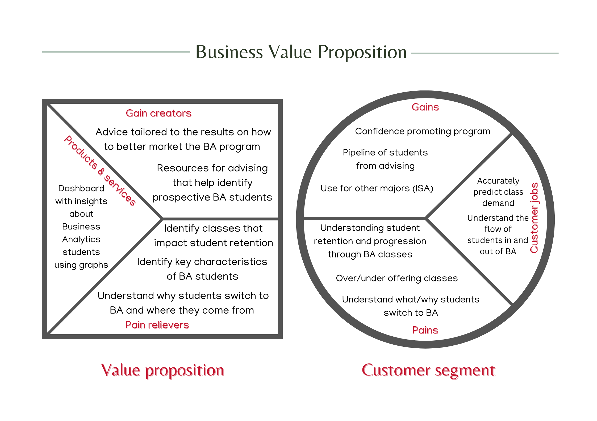
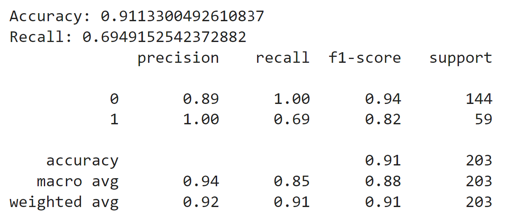
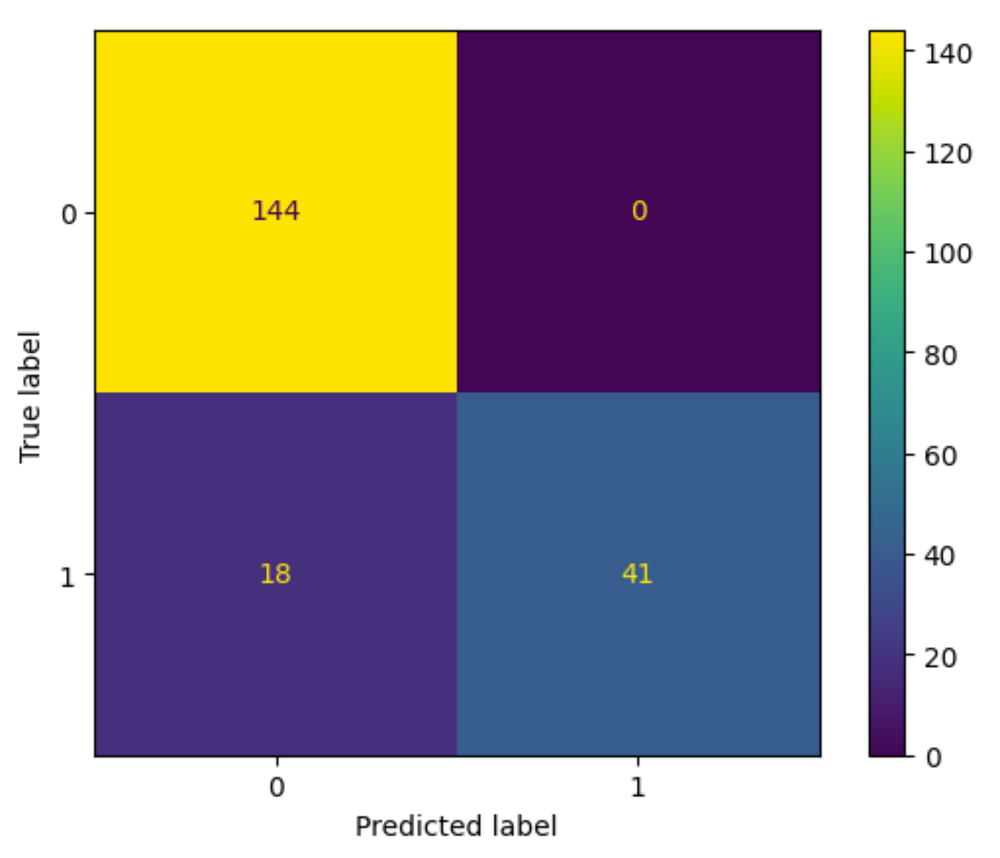
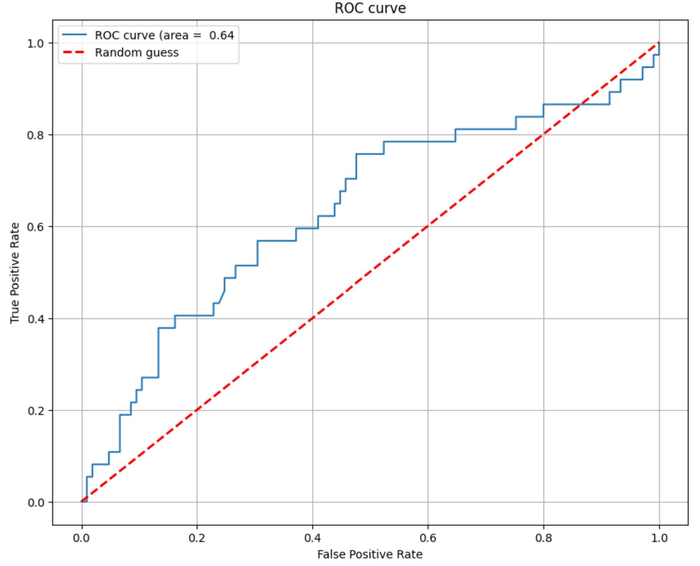
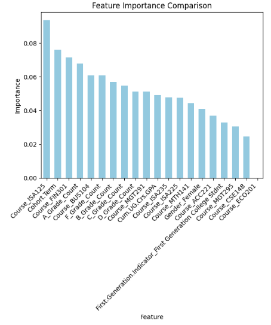

# Introduction

There is difficulty forecasting the number of students in a Business
Analytics program resulting in challenges with class size planning. We
look to answer these questions: (1) Historically, what characteristics
define students who stay with a Business Analytics program? (2) Is there
a pattern to the number of students staying or leaving a Business
Analytics program? (3) What courses have a significant impact on whether
students stay with the Business Analytics program?

In this document, we analyzed data from Miami University's Farmer School
of Business student data from fall 2018 to fall 2024 school years,
provided by clients Alan Clift and Skip Benamati. This data included
students who were enrolled in any Business Analytics program during
their time at Miami. Programs include the Business Analytics Major,
Minor, and ISA2 thematic sequence. We used a XGBoost Classifier model to
predict whether a student enrolled in the Business Analytics program
would eventually drop based on the features of our model. We used a
binary "flagging" target variable (column with 1 or 0) to denote if they
left their program or not (1= leave, 0 = stay) at any time. Furthermore,
we utilized portions of the student data, organized by program type, to
conduct descriptive analysis on trends related to enrollment to support
our analysis of answering the research questions above and forecast student enrollment in each program for the following two semesters.

### Business Value Proposition



Client:

-   Skip Benamati Professor and chair of the Information Systems &
    Analytics along with his staff including Alan Clift (Data and
    planning Analyst) and Professor, Alison Jones-Farmer.

Jobs:

-   Accurately predict demand for classes

-   Understand the flow of students in and out of Business Analytics
    programs

Pains:

-   Before:

    -   Abundance of BA students who end up dropping

-   During:

    -   Student retention -- understanding characteristics of students
        who stay and do not stay with the BA program

    -   Understanding what students are switching to the BA program

    -   If BA courses have an impact on whether students stay in
        business analytics

-   After:

    -   Over offering classes (results in too many small sized classes)

Solution:

-   Descriptive analysis and projection of future enrollment for the
    next two semesters. A predictive model to determine is a student
    will drop or stay in their program.

Pain Killers:

-   Identify key characteristics of students who leave the program

-   Identify classes that may need curriculum change in order to retain
    my students

-   Understand why students switch to the BA program

Gains:

-   Confidence promoting program

-   Pipeline of students from advising

-   Use for other majors (ISA)

Gain Creators:

-   Advice tailored to the results on how to better market the BA
    program

-   Resources for advising that help identify prospective BA students

# Data Cleaning and Preparation

## Session Information

For the purpose of data reproducibility, we included the session info
and loaded all required packages in this one location.

```{r setup, include=FALSE}
knitr::opts_chunk$set(echo = TRUE)

if(require(pacman)==FALSE) install.packages("pacman")
pacman::p_load(#DataExplorer, # For explorer and cleaning data by visualizing missing values.
               gptstudio,#For coding assistance
               httr, # For downloading the data from the UCI
               tidyverse, # For data manipulation
               sjPlot, 
               corrplot, # for heatmaps
               DataExplorer, #for exploring data
               skimr, # for nice summary of data
               readxl,
               dplyr
               ) # For creating dummy variables of categorical variables automatically.)
```

```{r}
sessionInfo()
```

## Import and Merge Files

Here we imported files: Attributes, BA_Majors, BA Major Students -
Minors, BA Major Students - Thematic Sequence ISA2.

-   Attributes.csv: renamed to studentinfo, this file identifies an
    individual student in a business analytics program by a Student.ID
    and columns include student information including their gender,
    first generation status, cumulative GPA, and term code. Each student
    has a row for every term they have been enrolled. We dropped the
    index column called X

-   BA_Majors.csv: renamed to studentlist, is similar to Attributes in
    which it identifies the student by Student.ID with a row for every
    term they have been enrolled at Miami. It also includes their
    cohort, and major (with a column for 3 potential majors. We dropped
    the index column called X and the Enrolled Student Count column
    because they were not important to our analysis.

-   BA Major Students - Minors.xlsx: This file was renamed to minors and
    includes a table of students who were classified as Business
    Analytics minors along with a row for each term they were enrolled
    at Miami. It was given to us as in the raw data folder and we had to
    unmerge and populate cells to use it as a table in our analysis. The
    file included the count of enrolled students by term which we
    displayed as a bar graph.The table also includes a column for their
    cohort which is their freshman semester at Miami. We renamed columns
    to match the other tables with the same columns and dropped
    unnecessary columns like Enrolled Student Count.

-   BA Major Students - Thematic Sequence ISA2.xlsx: Renamed to
    thematic, this table represents all of the students who had at one
    point been enrolled in the business analytics thematic sequence
    titled "ISA2 Applied Business Statistics". It was given to us as in
    the raw data folder and we had to unmerge and populate cells to use
    it as a table in our analysis. Like the other tables, this one
    includes Student.ID, Term.Code as well as the thematic sequence
    title.

Each of these files loaded individually and merged into one common table
on the Student.ID and Term.Code columns, and called merged_data.
Repeated columns were dropped during this process so each row represents
one term of enrollment for each student, and sequential information
about the student during that sememster.

```{r}
# Read in Attributes File and drop column
studentinfo <- read.csv("Attributes.csv")
studentinfo = studentinfo %>% select(-`X`)

## Read in BA_Majors.csv and drop column
studentlist <- read.csv("BA_Majors.csv")
studentlist = studentlist %>% select(-`X`)

# Combine the two data frames
merged_data <- merge(studentinfo, studentlist, by = c("Student.ID", "Term.Code"))
```

```{r}
minors <- read_excel("BA Major Students - Minors.xlsx")
minors <- minors %>% rename(Student.ID = `Student ID`, Term.Code = `Term Code`, Cohort.Term = `Cohort Term`)
minors = minors %>% select(-`Enrolled Student Count`)

merged_data <- merge(merged_data, minors, by = c("Student.ID", "Term.Code"), all.x = TRUE, all.y = TRUE)
merged_data = merged_data %>% select(-`Cohort.Term.y`)

```

```{r}
thematic <- read_excel("BA Major Students - Thematic Sequence ISA2.xlsx")
thematic <- thematic %>% rename(Student.ID = `Student ID`, Term.Code = `Term Code`, Thematic.Sequence.Title = `Thematic Sequence Title`)
thematic = thematic %>% select(-`Enrolled Student Count`)

merged_data_1 <- merge(merged_data, thematic, by = c("Student.ID", "Term.Code"), all.x = TRUE, all.y = TRUE)
```

## Add Column for Students who dropped any Business Analytics program

Our goal is to understand a business analytics student's progression
through their program and therefore we added a column titled flag to
denote if they left their program or not. With this information, we can
track what students leave which we will use in a predictive model as the
target variable.

In order to correctly flag if someone dropped their business analytics
program (Major, Minor, or Thematic), we grouped the student by their ID,
and if they dropped their program, we dropped their most recent
semester. This is because each student only has the semesters
before/during their business analytics program and one semester after.
Therefore, to predict why they may have dropped, we are not including
the semester after they dropped their program.

Dropping this last semester in included in the table,
merged_drop_last_2, and a column for flagged was added onto the
merged_data table and called merged_with_flag_3. For reference, we also
created a table of only students who flagged a 1, which means they
dropped their program, to compare to the merged_data table and check for
correctness.

```{r}
merged_drop_last_2 <- merged_data_1 %>%
  group_by(Student.ID) %>%
  filter(!(last(Major.1 != 'BA Major' & Major.2 != 'BA Major' & Major.3 != 'BA Major' & Minor != 'Business Analytics' & Thematic.Sequence.Title != 'ISA2 Applied Business Statistics', order_by = Term.Code) & row_number() == n()))
```

```{r}
merged_with_flag_3 <- merged_drop_last_2 %>% group_by(Student.ID) %>% mutate (Flag = ifelse(n() < 8 & tail(Term.Code, 1) != '202410', 1,0)) %>% ungroup()
```

```{r}
flagged_true_4 = merged_with_flag_3 %>% filter(Flag == 1)
```

## Adding Grade Information with Students by Term Code

To help predict if students dropped the program or not, we also included
grade information for classes important to business analytics students.
This includes a row for each the class the student took along with their
StudentID, semester, and grade result. Unimportant columns were dropped,
and other columns renamed to match previous tables. The grade data was
merged into the merge_data file that was created above.

```{r}
grades <- read_csv("Grades.csv", show_col_types = FALSE)
grades = grades %>% select(-`...1`, -`GPA Quality Points`, -`Final Letter Grade`)
grades <- grades %>% rename(Student.ID = `Student ID`, Term.Code = `Term Code`, `Final Letter Grade Group` = `Final Letter Grade Group`)

merged_with_flag_and_grades <- merge(merged_with_flag_3, grades, by = c("Student.ID", "Term.Code"), all.x = TRUE, all.y = TRUE)

merged_with_flag_and_grades <- merged_with_flag_and_grades %>% rename(Cohort.Term = `Cohort.Term.x`)
merged_with_flag_and_grades = merged_with_flag_and_grades %>% select(-`Earned Academic Credit`)
```

## Export Files

We created two final files. One is the merged student information
with the flag denoting if they left the program and their grades. The
other file is the same information without a flag to use in our
predictive model. Both of these tables are exported to .csv files as
'StudentData_withGrades" and 'StudentData_NoFlag', respectively.

```{r}
no_flag = merged_with_flag_and_grades %>% select(-`Flag`)
```

```{r}
write.csv(merged_with_flag_and_grades, 'StudentData_withGrades')
write.csv(no_flag, 'StudentData_NoFlag')
```

# Descriptive Analysis and Forecast

The following charts are the distinct counts of students enrolled in
each business analytics programs. Programs include the Business
Analytics Major, Minor, and thematic sequenced (named Applied Business
Statistics). Each program is plotted individually over term from fall
2018 to fall 2024 as a bar chart. Using a naive forecasts, simple average, and simple average of growth rate, we forecasted enrollment in each of the programs for the coming two sememsters. 

## ISA2 Applied Business Statistics Thematic Sequence Enrollment by Term

Using the data from the file, 'Thematic Sequence.xlsx', we were able to
graph the number of students enrolled in the ISA2 Applied Business
Statistics Thematic Sequence. The file included the count of enrolled
students by term which we displayed as a bar graph. Using this visual,
we can predict the next two semesters, 202420 and 202510, with a naive
forecast. Starting in spring 2020 (noted as 202020 as the term code),
there was a significant decrease in the number of students enrolled in
this program. After that point, the enrollment stayed consistently
between 40-50. There are about 10 more students enrolled in the spring
of every semester than the fall for every academic year that the data
includes. Therefore, following the same pattern, we used a naive
forecast to project the next two semesters with the expected count for
202420 to be 52 enrolled students and 41 in 202510. These are the same
numbers from the same time, previous year and also falls the pattern
from the last 8 semesters. The two projections were added to the bar
chart and denoted in orange as forecasted values.

```{r}
data = read_excel("Thematic Sequence.xlsx")

colnames(data) <- c("Term.Code", "Enrolled.Student.Count")

new_data <- data.frame(
  Term.Code = c(202420, 202510),
  Enrolled.Student.Count = c(52, 41))

new <- rbind(data, new_data)
```

```{r}
p <- ggplot(new, aes(x = `Term.Code`, y = `Enrolled.Student.Count`, fill = factor(`Term.Code`))) +
  geom_bar(stat = "identity", color = "steelblue", width = 0.8) +
  xlab("Term.Code") +
  ylab("Enrolled.Student.Count") +
  ggtitle("ISA2 Thematic Sequence Enrollment over Terms") +
  theme_bw() +
  theme(axis.text.x = element_text(angle = 45, hjust = 1)) +
  geom_text(aes(label = `Enrolled.Student.Count`), vjust = -0.5, color = "black", size = 3) +
  coord_cartesian(ylim = c(0, 300)) +
  scale_fill_manual(values = c(rep("steelblue", nrow(new) - 2), "orange", "orange"))+
   guides(fill = FALSE)

p
```

## Business Analytics Minor Enrollment by Term

Using the data from the file, 'BA Minors.xlsx', we were able to graph
the number of students enrolled in the Business Analytics minor. The
file included the count of enrolled students by term which we displayed
as a bar graph. Using this visual, we predicted the next two semesters,
202420 and 202510, with a simple average of the previous two respective fall and springs semesters to forecast. The most recent four semesters
(202220 through 202410) were consistent in enrollments and similar to
the thematic sequence, following the pattern that the fall semester had
fewer enrolled than the spring semester of that academic year.
Therefore, to continue the same pattern, we averaged the previous two
spring semesters to project the 202420 term and continued this to get a
projection for the fall 2025 term. The two projections, which are both
simple averages, were added to the bar chart and denoted in orange as
forecasted values.

```{r}
data = read_excel("BA Minors.xlsx")

colnames(data) <- c("Term.Code", "Enrolled.Student.Count")

new_data <- data.frame(
  Term.Code = c(202420, 202510),
  Enrolled.Student.Count = c(185, 147))

new <- rbind(data, new_data)

p <- ggplot(new, aes(x = `Term.Code`, y = `Enrolled.Student.Count`, fill = factor(`Term.Code`))) +
  geom_bar(stat = "identity", color = "steelblue", width = 0.8) +
  xlab("Term Code") +
  ylab("Enrolled Student Count") +
  ggtitle("Business Analytics Minor Over Terms") +
  theme_bw() +
  theme(axis.text.x = element_text(angle = 45, hjust = 1)) +
  geom_text(aes(label = `Enrolled.Student.Count`), vjust = -0.5, color = "black", size = 3) +
  coord_cartesian(ylim = c(0, 300)) +
  scale_fill_manual(values = c(rep("steelblue", nrow(new) - 2), "orange", "orange"))+
   guides(fill = FALSE)

p
```

## Business Analytics Major Enrollment by Term

We conducted a descriptive analysis on the business analytics major
enrollment by term to project the next two semesters of enrollment. We
used our merged data frame that was created with four student data files
before adding student grade information and displays student information
by term. This data frame includes student information for any students
in a business analytics program. Therefore, we created a count of
students grouped by term, who noted Business Analytics as their major in
columns Major.1, Major.2, and Major.3. From there we displayed the
student enrollment over academic terms.

```{r}
merged_data = merged_data

ba_major_counts_by_term <- aggregate(Major.1 ~ Term.Code, data = merged_data, function(x) sum(x == "BA Major"))

ba_major_counts_by_term2 <- aggregate(Major.2 ~ Term.Code, data = merged_data, function(x) sum(x == "BA Major"))

ba_major_counts_by_term3 <- aggregate(Major.3 ~ Term.Code, data = merged_data, function(x) sum(x == "BA Major"))

# Assuming ba_major_counts_by_term, ba_major_counts_by_term2, ba_major_counts_by_term3 are your data frames
merged_counts <- merge(ba_major_counts_by_term, ba_major_counts_by_term2, by = "Term.Code", all = TRUE)
merged_counts <- merge(merged_counts, ba_major_counts_by_term3, by = "Term.Code", all = TRUE)

# Replace missing values with zeros
merged_counts[is.na(merged_counts)] <- 0

# Set column names for clarity
names(merged_counts) <- c("Term.Code", "BA_Major_Count_1", "BA_Major_Count_2", "BA_Major_Count_3")

```

```{r}
merged_counts <- merged_counts %>%
  mutate(Sum_BA_Major_Count = BA_Major_Count_1 + BA_Major_Count_2 + BA_Major_Count_3)

merged_counts <- merged_counts %>%
  select(Term.Code, Sum_BA_Major_Count)
```

```{r}
merged_counts$Term.Code <- as.character(merged_counts$Term.Code)
```

```{r}
new_data <- data.frame(
  Term.Code = c(202420, 202510),
  Sum_BA_Major_Count = c(356, 430))

new <- rbind(merged_counts, new_data)

p <- ggplot(new, aes(x = `Term.Code`, y = `Sum_BA_Major_Count`, fill = factor(`Term.Code`))) +
  geom_bar(stat = "identity", color = "steelblue", width = 0.8) +
  xlab("Term Code") +
  ylab("Enrolled Student Count") +
  ggtitle("Business Analytics Major Over Terms") +
  theme_bw() +
  theme(axis.text.x = element_text(angle = 45, hjust = 1)) +
  geom_text(aes(label = `Sum_BA_Major_Count`), vjust = -0.5, color = "black", size = 3) +
  coord_cartesian(ylim = c(0, 500)) +
  scale_fill_manual(values = c(rep("steelblue", nrow(new) - 2), "orange", "orange"))+
   guides(fill = FALSE)

p
## 51.5% change between 2022 and 2023
## 21.5% change between 2023 and 2024
## 36.5% average between those two growth rates
```

The pattern of the previous two years helped us project the coming two
semesters. For spring 2024, the graph shows that the fall and spring
enrollment are very similar. We used a simple average of growth rates forecast for 202420 to continue this pattern determining that the projected enrollment in the
spring should be the same as the fall semester, 356 students. For the
fall semester 2025, we used a simple average of the growth rate between
previous two academic years to project the growth needed to calculate
the 202510 forecast. There was a 51.5% growth between 202220 and 202310
enrollment. Between 202320 and 202410, there was a 21.5% growth.
Averaging these two growth rates gets 36.5% growth from 202420 to
202510, or 430 students. The two projected enrollments are notes in the
bar chart in orange.

# Predictive Model - XGBoost Classifier

### **Model Overview:**

Our goal is to understand a business analytics student's progression
through their program and therefore we added a flag (column with 1 or 0)
to denote if they left their program or not (1= leave, 0 = stay) at
anytime. With this information, we can track what students leave which
we used in a predictive model as the target variable.

[Link to trained model](616model_final.html)

The XGBoost Classifier we created had an accuracy score of 91.63%, with
an AUC of 63.59% and a recall of 71.19% on class 1. The precision of
class 1 was 89%. Feature importances revealed there were 20 important
factors in the models.

### **Evaluation Metrics:**

The accuracy is defined as the ratio of correct predictions to the total
number of predictions. In this case, our model correctly predicted if a
student will drop their program, 91.63% of the time. 

Precision is concerned with the accuracy of the prediction of 1, or
positive predictions. It is defined as the ratio of true positive
predictions (correct prediction of 1's) to the total number of positive
predictions made by the model. Our model has a precision of 89%, which
means out of the times that we predict if the student dropped, we are
correct 89% of the time.

The most important metric to our model is the recall which measures the
ratio of true positives to total predicted positives. We want to use
this metric because it's more important to reduce the chance that our
model missed a student who dropped their program than overestimating the
number of students dropping. Our model has a 69.49% which means that we
missed only about 30% of students who dropped the program. The model
performs with moderate ability in this case. Each of these metrics are
displayed in the classification report and confusion matrix of our
trained model using testing data. The confusion matrix shows the
distribution of True and predicted outcomes.

Classification Report:



Confusion Matrix:



ROC Curve:

The Area Under the Curve (AUC) is a common metric used to evaluate the
performance of a binary classification model, such as our XGBoost
classifier. The ROC (Receiver Operating Characteristic) curve is a
graphical representation of our model's ability to discriminate between
the two classes (flag or no flag) across different probability
thresholds. An AUC score of 63.59% for an XGBoost classifier predictive
model means that, on average, the model is able to distinguish between
the two classes with moderate reliability. The red line represents how
well random guess performs so the goal is for a model to curve above the
red line.



Feature Importance



The variables with the highest importance according to our feature
importance analysis are Course_ISA125, Cohort.Term, Course_FIN301,
A_Grade_Count, Course_BUS104.

### **Implementation**

The XGBoost Classifier can be implemented into the Information Systems
and Analytics department to help flag potential students who are likely
to drop the program. The results of our Classifier answer our second
research question, Is there a pattern to the number of students staying
or leaving a Business Analytics program?

Using our predictive model to flag students who drop the program, the
feature importances shows what the most important variables are that
affect the student's decision. We can see that courses such as ISA125,
BUS104, and FIN301 have an influence on the flow of students. These
feature importances answers our third research question. We also found
that A and B grade count had an influence showing there are
characteristics to the students who stay with a Business Analytics
program. All of these important factors help determine what
characteristics define students who stay with a Business Analytics
program, answering our first research question.

To help implement our predictive model, we created a guide that uses our
trained model and takes new information, to predict if a student will
drop or continue with their program.

[Link to implementation
guide](616Model_implementation.html)

Overall, we believe implementing our XGBoost Classifier and using our
forecasts from our descriptive analysis will help eliminate Dr.
Benamati's challenges.
